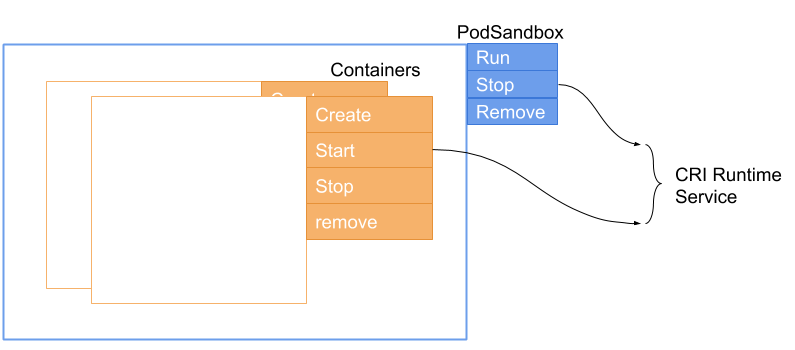
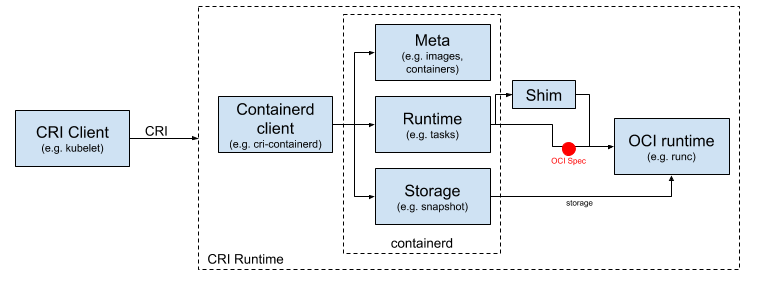
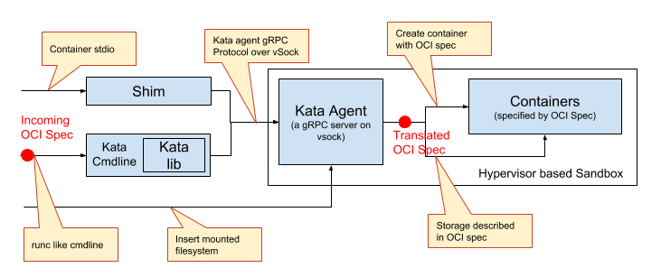
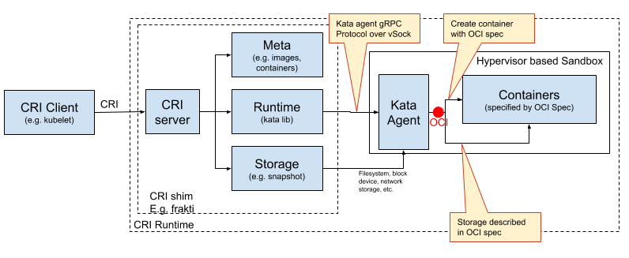

# Working Scenarios of Kata Container

- [CRI](#cri)
- [OCI based CRI Runtimes](#oci-based-cri-runtimes)
  - [PodSandbox in OCI based runtimes](#podsandbox-in-oci-based-runtimes)
  - [Typical working pattern of CRI runtimes](#typical-working-pattern-of-cri-runtimes)
- [Frakti CRI Runtime](#frakti-cri-runtime)
  - [The APIs Frakti rely on](#the-apis-frakti-rely-on)
  - [Working pattern of Frakti](#working-pattern-of-frakti)
- [Working with Docker](#working-with-docker)

## CRI

The operations defined in CRI RuntimeService are quite straightforward. There are two parts (as shown in the figure): PodSandbox operations and Container Operations.

The CRI clients simply call PodSandbox Run to start a sandbox (Pod), and Create / Start / Stop / Remove containers inside it. The life cycle of containers are inside a sandbox life cycle.

For kata container, the sandbox are implemented with a virtual machine (agent is its delegator), and the containers are created with OCI spec by the agent.

## OCI based CRI Runtimes

The OCI spec is not aware of PodSandbox, and it defines the [lifecycle of containers](https://github.com/opencontainers/runtime-spec/blob/master/runtime.md#lifecycle).

### PodSandbox in OCI based runtimes

The cri-containerd and CRI-O create a special container for PodSandbox. Once get an RunPodSandbox request, the cri-containerd (or CRI-O) will launch container created with a configured image, and use the container as the PodSandbox.

By default, the pod container is created through the same OCI runtime, however, for Kata, this will be mapped to a virtual machine. That is, the kata-runtime will do a “cheat”, create a virtual machine sandbox if it found the request is to create a PodSandbox instead of a user container.

### Typical working pattern of CRI runtimes

As shown in the above figure, the current CRI runtimes run OCI (or, say runc) containers on a storage (mounted filesystem) in a namespace with the OCI spec.

When the Kata runtime work with the above CRI runtimes, as a result, in the design of kata containers (and runV, clear containers) the detail of the runtime part is illustrated in the following figure:

## Frakti CRI Runtime

### The APIs Frakti rely on

Frakti is a more CRI specified runtime, it was created at the same time with CRI was created, and the current version working with hyperd comes from Hyper. The Frakti/Hyperd 1.0 working on runV hypervisor APIs instead of command line. The main runtime control APIs are listed in the following table.

| CRI API         | kata-runtime-runV hypervisor API        |
|:----------------|:----------------------------------------|
|RunPodSandbox    |GetVM                                    |
|StopPodSandbox   |Shutdown                                 |
|RemovePodSandbox |(cleanup in host)                        |
|CreateContainer  |AddContainer (add rootfs, volume, inf...)|
|StartContainer   |StartContainer                           |
|StopContainer    |KillContainer + WaitProcess              |
|RemoveContainer  |RemoveVolume (, cleanup in host)         |

As a summary, the required API include: sandbox operation APIs, per-container plug/unplug APIs, resources plug/unplug APIs, other assisted APIs such as wait, and iostream APIs etc.

### Working pattern of Frakti

And frakti will work with kata as soon as the Kata runtime has a working API set. With these APIs, frakti could work in the following pattern:

In the kata/CRI native manner, another point is we could avoid use too many independent shim and proxy processes, some investigates shows a shim consumes much memories, and it would be a big overhead in high density cases.

## Working with Docker

When working with Docker & containerd, the runtime will work in the similar way.

